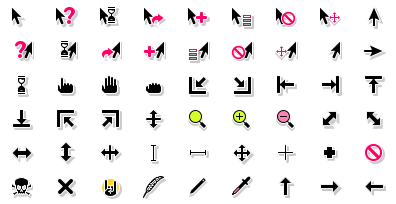

Overview
--------

Hackneyed is a scalable cursor theme mildly resembing old Windows 3.x/NT 3.x cursors. Dark and left-handed versions are also available.


Building
--------
Minimum dependencies:

* ImageMagick (>=6.8.6 but not 7.0, as it has huge API changes)
* Inkscape (>=0.92.3)
* GNU `make` and `bash`
* `xcursorgen` (part of `xorg-x11-apps`)

* To generate and pack Windows cursors:
	* A working C compiler;
	* `ImageMagick` >= 6.8.6;
	* `libpng` >= 1.6.36;
	* `pkg-config`;
	* `zip`.

Production targets (all of them generate tarballs for distribution):

* `dist`: build the scalable, right-handed theme;
* `dist.left`: build the scalable, left-handed theme;
* `dist.<size>`, where `size` can be small, medium or large: build a fixed-size, right-handed theme of the specified size;
* `dist.<size>.left`: build a fixed-size, left-handed theme of the specified size;
* `windows-cursors` for Windows. These cursors employ an alpha channel and are compatible with Windows XP and later (Windows 10 users: they are high-DPI ready as well).

`make all-dist` targets all of the above (except `windows-cursors`), including all fixed-size themes in all available sizes.

`small`, `medium` and `large` are currently defined as 24, 36 and 48, respectively. The making of individual cursors recognizes the integer argument only (see below).

The targets described below are meant for debugging and do not generate tarballs:

* `theme`: make the scalable, right-handed theme;
* `theme.left`: make the scalable, right-handed theme;
* `theme.<size>`: make a fixed-size, right-handed theme of the specified size;
* `theme.<size>.left`: make a fixed-size, left-handed theme of the specified size.

All of them run `do-symlinks.sh` when finished. The targets below do not:

* `all`: make the scalable, right-handed theme;
* `all.<size>`: make a fixed-size, right-handed theme of the specified size;
* `all.left`: make the scalable, left-handed theme;
* `all.<size>.left`: make a fixed-size, left-handed theme of the specified size.

Individual cursors can be made with `make <cursor_name>.<size in pixels>.<orientation>`, e.g.:

* `make default.24.left` for a left-handed, 24px `default` cursor;
* `make default.24` for a right-handed, 24px cursor;
* `make default.left` for a scalable, left-handed cursor;
* `make default.24.png` for a 24px PNG only. PNG sizes aren't hardcoded, so you can specify any size you want;
* or simply `make default` for a scalable, right-handed cursor.

Parallel jobs (`-j`) are recommended (Inkscape is _slow_).

If you don't feel like building it from source, grab the latet builds from the artwork page on [openDesktop.org](https://www.opendesktop.org/p/999998/) or from [Gitlab](https://gitlab.com/Enthymeme/hackneyed-x11-cursors/-/releases).

To build the dark theme, tell `make` to use the dark versions of `COMMON_SOURCE`, `RSVG_SOURCE` and `LSVG_SOURCE`, and change `THEME_NAME`:

`$ make -B THEME_NAME=Hackneyed-Dark COMMON_SOURCE=theme/common-dark.svg RSVG_SOURCE=theme/right-handed-dark.svg LSVG_SOURCE=theme/left-handed-dark.svg <target>`


Installation
------------
Simply choose a tarball and extract it to `$HOME/.icons`. If you've built it from source, pick a size or variant (e.g., `Hackneyed`, `LHackneyed-36px`) and move it to `$HOME/.icons`.


License
-------
Hackneyed is released under the MIT/X11 license.


Credits
-------
* do-symlinks.sh, rewrite of addmissing.sh, taken from [dummy-x11-cursors](https://www.opendesktop.org/p/999853/) by ultr

* some SVGs taken from openclipart.org (pencil, pirate and coffee_mug as far as I can remember)

* pencil and pirate borrowed from Breeze

* monolithic SVG idea (and the SVG itself) taken from KDE's [Breeze theme](https://github.com/KDE/breeze/tree/master/cursors) by Ken Vermette, who probably liked Jakub Steiner's DMZ way too much (but not enough to keep the Python script)

* ico2cur.c, a C rendition of [ico2cur.py](https://gist.github.com/RyanBalfanz/2371463)


Bugs/enhancements
-----------------
Suggestions and bug reports can be made here or on openDesktop.


A word about hashes
-------------------
libXcursor-based applications will return a hash for custom cursors when you run them
like `env XCURSOR_DISCOVER=1 <executable>` on a terminal. Take into account only the hashes
that return zero, e.g., "Cursor hash `0xdeadbeef` returns `0x0`".

(Forget about doing this to animated cursors: a hash is generated for every frame.)


Useful links
------------
* [Freedesktop.org's cursor specification](http://www.freedesktop.org/wiki/Specifications/cursor-spec/)

* [CSS cursors from W3C](http://dev.w3.org/csswg/css-ui/#propdef-cursor "2drafty4u")

* [Mozilla's test page for CSS cursors](https://developer.mozilla.org/en-US/docs/Web/CSS/cursor)

* [Qt requirements for X11 cursors](http://doc.qt.io/qt-5/qcursor.html#a-note-for-x11-users)

* [Core X11 cursors](http://tronche.com/gui/x/xlib/appendix/b/ "coffee_mug > all")


Setting a default theme for all applications
--------------------------------------------
Setting the cursor theme through a graphical interface doesn't always propagate to all applications. _Most of the time_, this can be solved by creating a file called `index.theme` with the following content...

```
[Icon Theme]
inherits=Hackneyed      # or Hackneyed-48px, LHackneyed etc.
```

...and saving it in `~/.icons/default` (create the folder if it doesn't exist already).

Chromium and Chromium-based browsers won't pick up a new theme unless you restart the browser (seems to be fixed in Chromium 80).


Known bugs
----------
The bugs described below are NotMyProblem<sup>TM</sup> and should be dealt with by upstream:

- **Qt on Wayland outside Plasma:** If you're not on KDE, create a `~/.icons/default/index.theme` as described above or use `XCURSOR_THEME=Hackneyed XCURSOR_SIZE=<current cursor size> QT_QPA_PLATFORM=wayland <qt application>` and check if something is amiss--as of now, Qt's (hopefully) makeshift CSD implementation switches to `split_h` and `split_v` in the borders of the window, which is *wrong*. At least within KDE itself, cursors use the proper size and shape.

- Qt on Wayland outside KDE is also not *that* great if you want to resize a window without holding `<Super> + middle click` *every goddamn time*, as having no "virtual" border to grab onto will be a test of patience and pointing device skills.

- **`all-scroll` as `move` on Firefox, Chromium 62+ and derivatives:** Firefox has a [14-year-old bug](https://bugzilla.mozilla.org/show_bug.cgi?id=275174) concerning exactly this. Still nothing about Chromium.

- **GTK 4.** GTK 4 only looks for cursor themes in `/usr/local/share/themes` or `/usr/share/themes`. If Flatpak is installed, then it searches whatever `<datadir>/flatpak/exports/share` is available (either system-wide ones or in `~/.local/share/flatpak`). I really hope this was a mistake on their part.

To do
-----
Hackneyed's "build system" sucks and I should replace it eventually.
